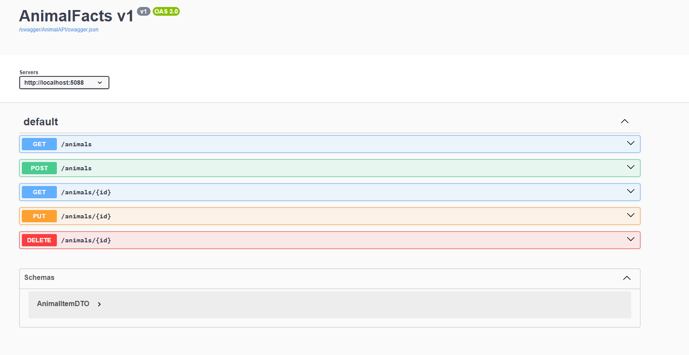
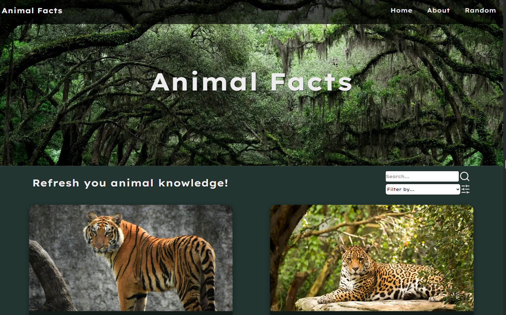
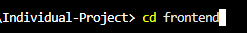
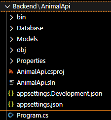
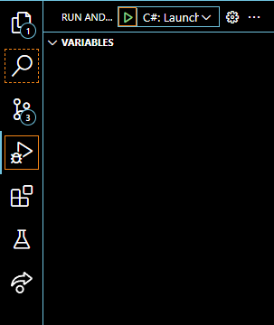
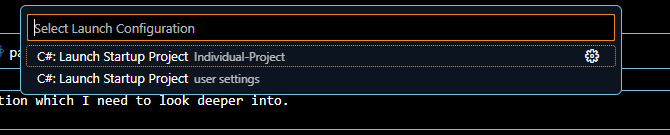

# Individual-Project: Animal Facts

[](https://skillicons.dev)

## Table of Contents
- [Project Summary](#project-summary)
- [Features Backend](#-backend-aspnet-core-minimal-api)
- [Features Frontend](#-frontend-nextjs--react)
- [Installation](#installation)
- [Future Plans](#future-plans)

## Project Summary

I wanted to make this project to use what I have learned during my education period and have design and layout as my focus to work on the areas I'm not as good at.

The project is a website about Animal Facts. Where I use .Net to create a minimal API and use it on the FrontEnd website.

This project is made with Next.js, React primarly and ASP .Net Core, EntityFramework for the BackEnd API.

The API has hard coded data that is used for the project.

## 🧠 Backend (ASP.NET Core Minimal API)



* **Framework:** ASP.NET Core with Entity Framework.

* **Data Source:** Uses hardcoded data to simulate a database of animal facts.

* **Endpoints:**

    - Retrieve all animal data and images.

    - Retrieve animal data and images by ID.

* **Architecture:** Clean and minimal, perfect for learning API fundamentals and integration with a modern frontend.

## 🎨 Frontend (Next.js & React)



* **Framework:** Next.js with React for fast rendering and routing.

* **Pages:**

- **Home:** Features search, filter, pagination, and a hero image carousel.

- **About:** A simple static page.

- Animal Detail (ID) Page: Displays in-depth info including species, diet, environment, and more.

* **Components:**

- **Header:** Navigation to Home, About, and Random ID.

- **Slideshow:** An image carousel where you can pause the slideshow by hovering over it.

- **Animal Cards:** Show images, names, and tags; link to detailed view.

- **Search & Filter Bars:** Reactively filter animal data using URL parameters.

- **Pagination:** Displays 6 cards per page with logic adjusting to filtered results.

- **Footer:** Contains GitHub/LinkedIn links and scroll-to-top button.

## 💾 Installation

* **Prerequisites**
    - Visual Studio Code
    * Extensions
        - C#

* **Installation**
* Create a new project in Visual Studio Code

* Open terminal and use command: ```git clone https://github.com/Zyzero95/Individual-Project.git```

* Change directory to the frontend folder: ```cd frontend```


* Go to the backend folder and open Program.cs
    


* Run and Debug ```(Ctrl+Shift+D)``` and choose C# as the debug option


* Choose C#: Launch Startup Project (Individual Project)


* Start the Run and Debug, ```F5``` this will run the API so you can access its data

* Open a new terminal window

* Make sure you are still in the frontend directory

* Use the command: ```npm install``` to install all dependencies for the frontend folder

* Use the command: ```npm run dev``` or if you want to build and start the project use: ```next build , next start```

## 📝 Future Plans

* **Features**
    - I want to make my search and filter section more advanced, using more features and smarter queries.
    - I want to keep developing my design to make it look better and have better responsiveness.
    - I want to make my About Page more proper for the project.

* **Bug Fixes**
    - The pagination does not work as intended if you search for an animal which generates less pages than the page you are currently on.
    - I still sometimes get Response 400: Bad Request from my API fetch function which I need to look deeper into.